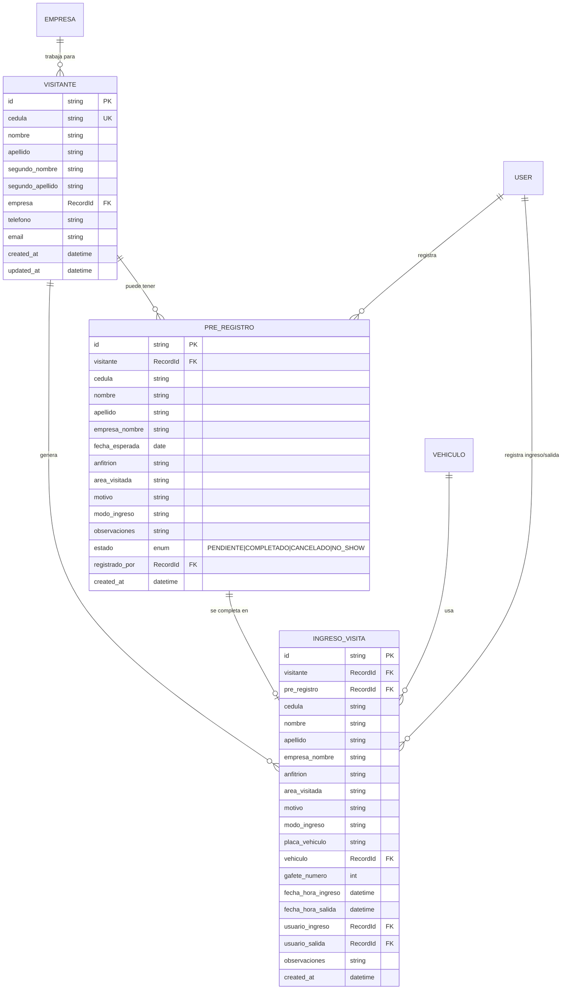

# Diseño: Flujo de Visitas

## Modelo de Datos



---

## Flujos de Operación

### Flujo 1: Walk-in SIN registro previo
```
Visitante llega → No tiene pre-registro NI está en catálogo
───────────────────────────────────────────────────────────
1. Guardia escribe cédula
2. Sistema busca: ❌ No en catálogo, ❌ No pre-registro
3. Formulario COMPLETO (datos personales + datos de visita + gafete)
4. Al guardar:
   • Crea registro en VISITANTE (catálogo)
   • Crea registro en INGRESO_VISITA
```

### Flujo 2: Walk-in CON registro en catálogo
```
Visitante llega → Está en catálogo pero sin pre-registro
───────────────────────────────────────────────────────────
1. Guardia escribe cédula
2. Sistema busca: ✅ En catálogo, ❌ No pre-registro
3. Datos personales PRE-LLENADOS (nombre, empresa)
4. Formulario PARCIAL (anfitrión, área, motivo, gafete)
5. Al guardar: Solo crea INGRESO_VISITA
```

### Flujo 3: Pre-registro (guardia recibe correo)
```
Anfitrión manda correo con lista de visitantes esperados
───────────────────────────────────────────────────────────
1. Guardia abre módulo de Pre-Registro
2. Por cada persona del correo:
   a. Escribe cédula
   b. ¿Está en catálogo?
      • SI → Cargar datos, completar campos faltantes
      • NO → Llenar datos personales completos
   c. Llenar: fecha esperada, anfitrión, área, motivo
   d. Al guardar:
      • Si no existía → Crear VISITANTE
      • Crear PRE_REGISTRO (estado: PENDIENTE)
```

### Flujo 4: Ingreso CON pre-registro
```
Visitante llega y tiene pre-registro pendiente
───────────────────────────────────────────────────────────
1. Guardia escribe cédula
2. Sistema busca: ✅ En catálogo, ✅ Pre-registro PENDIENTE
3. Vista SIMPLIFICADA (datos ya cargados, solo pedir gafete)
4. Al guardar:
   • Crea INGRESO_VISITA (con pre_registro_id)
   • Actualiza PRE_REGISTRO → estado: COMPLETADO
```

---

## Políticas Definidas

| Política | Decisión |
|----------|----------|
| **Fecha diferente** | Si llega otro día: marcar pre-registro como NO_SHOW y crear nuevo ingreso (walk-in) |
| **Múltiples pre-registros** | ✅ Puede tener varios pendientes simultáneos |
| **Expiración** | Automática después de **72 horas** → Estado: NO_SHOW |
| **No-Show** | Automático: al final del día si no llegó |
| **Vehículo** | Igual que contratista: si no tiene registrado se crea, si tiene lista se selecciona |

---

## UI Sugerida


### Módulo Pre-Registro
- Vista principal: Lista de pre-registros pendientes
- Acciones: Crear nuevo, Dar ingreso, Cancelar, No-Show
- Filtros: Por fecha esperada, por estado

### Flujo de Ingreso (decisiones)
```
🔍 Buscar por cédula
        ↓
   ¿Tiene pre-reg?
    SI     NO
    ↓       ↓
  Vista   ¿En catálogo?
  Rápida   SI    NO
           ↓      ↓
         Vista  Vista
        Parcial  Full
```
